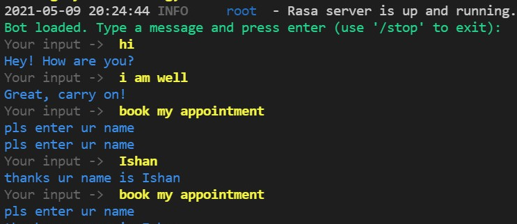
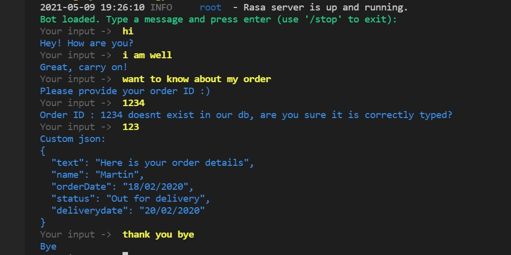

*Bots Rise!*

Get your copy of the chatbot:

     $ git clone https://github.com/ik159/rasa-chatbot.git

Sit back and relax. The chatbot offers a one step installation. Run : 

     $ make setup

*Note*: The above can fail in case of dependency issues on your local. If you wish to continue without upgrading to the following recommended requirements: 

- pip3 (version > 20)
- python3 (<= 3.7)
- Tensorflow tools (>=12)
- python3-dev (>1.17.0)
- Rasa (=2.6.0)

**Manual Steps** :

To fulfill minimum requirements, run the follwoing chain of commands which will test and upgrade all the packages needed to fire up your bot : 
    
     $ pip3 install --upgrade pip

     $ python3 install --upgrade python

     $ python3 -m pip install python-dev-tools --user --upgrade

Install Rasa :
    
     $ pip3 install rasa

Train your modules :
    
     $ rasa train

Run the following command in a new terminal to get the action server live : 

     $ rasa run actions

Your bot is now up and running! Open a third terminal and run the follwoing command to be able to talk to  your assistant :

     $ rasa shell

The IVR feature deploys the Mozilla STT and TTS libraries. They have been tested against sample data sets successfully. To test the IVR abilities of the chatbot,
you may run it against the sample data provided in the *deepspeech_test_prediction.py* and *test_tts.py* files.

*Setup* :

    $ python setup.py develop
    $ pip3 install deepspeech    

*Run* :

STT -     
    
    $ python3 deepspeech_test_prediction.py
    
Upon running the script, you will see a message ‘Recording...’. Record a sentence you would like to test the model on. The output will be saved in the file *test_tts.wav*.   

TTS -

    $ python3 setup.py develop 
    
Once the script stops running, the result will be saved in the test_tts.wav file which you can listen to to test the performance of the model.
 
Additionally, the model uses hashed headers providing an added layer of safety. 

**Future Plans** :

- We plan to implement internaitonalization to make the product scalable 
- Host the chatbot on an internal load balancer network to improve upon security.
- Deploy on on AWS with Route 53 routing, allowing us to regulate resources based on the traffic state
 
Thank you for testing our bot <3

Created by: 
**Team Yumit**
- Ishan Kumar (@ik159)
- Shriti Chandra (@chandrashritii)
  
